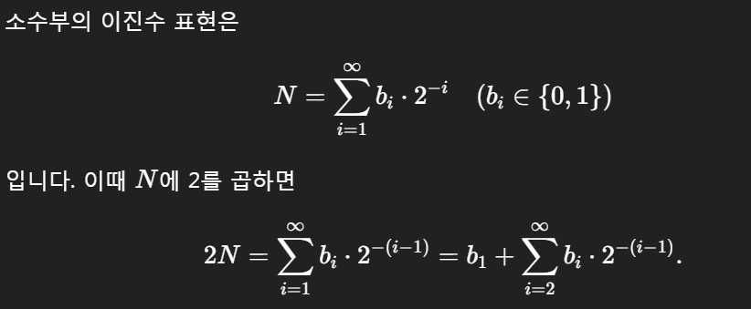

# 내코드

```py
T = int(input())
# 여러개의 테스트 케이스가 주어지므로, 각각을 처리합니다.
for test_case in range(1, T + 1):
    result = ""
    num = float(input())
    for i in range(1, 13):
        if num >= (2**(-i)):
            num -= (2**(-i))
            result += "1"
        else:
            result += "0"
        if num == 0:
            break
 
    if num != 0:
        print(f"#{test_case} overflow")
    else:
        print(f"#{test_case} {result}")
```

# 남의 코드
```py
T = int(input())
 
for t in range(1, T + 1):
    N = float(input())
    result = ""
 
    while N > 0:
        N *= 2
 
        if N >= 1:
            result += '1'
            N -= 1
        else:
            result += '0'
 
        # 12자리 초과 시 종료
        if len(result) > 12:
            result = "overflow"
            break
 
    print(f"#{t} {result}")
```
## 왜 * 2가 통하나요?


즉, 정수부가 바로 첫 비트가 된다.
- 만약 2N≥1이면 𝑏1=1이고, 
	​

=1이고 1을 빼 주면 다음 단계의 소수부만 남습니다.