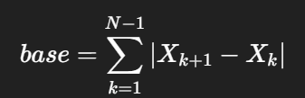
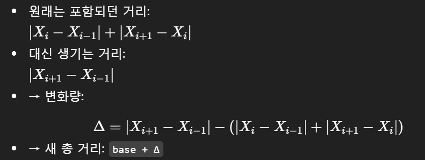

# 내 코드
```py
T = int(input())
for stage in range(1, T+1):
    N = int(input())
    pos = list(map(int, input().split()))
    min_dis = float('inf')
    for i in range(1, N-1):
        dis = 0
        pre_index = 0
        for j in range(1, N):
            if j == i:
                continue
            dis += abs(pos[pre_index] - pos[j])
            pre_index = j
        min_dis = min(min_dis, dis)
    print(min_dis)
```
# GPT 피드백
## 더 깔끔한 O(N) 풀이 (참고용)
지금 풀이는 **O(N²)**이지만 
𝑁
≤
50
N≤50이라 상관은 없어요.
그래도 “생각을 잘했다”는 느낌이 나게 한 번 더 정리해보면 이런 식으로도 쓸 수 있어요:

아이디어:

1. 아무 체크포인트도 건너뛰지 않았을 때의 총 거리를 먼저 계산:



2. 그 다음, 2번부터 N-1번 체크포인트 중 하나를 건너뛰면



```py
T = int(input())
for _ in range(T):
    N = int(input())
    pos = list(map(int, input().split()))

    # 1) 아무 체크포인트도 건너뛰지 않았을 때의 총 거리
    base = 0
    for i in range(N-1):
        base += abs(pos[i+1] - pos[i])

    # 2) 각 i(2~N-1번 체크포인트)를 건너뛸 때의 총 거리 계산
    ans = float('inf')
    for i in range(1, N-1):  # 0-based: 1~N-2 → 1-based: 2~N-1
        removed = abs(pos[i] - pos[i-1]) + abs(pos[i+1] - pos[i])
        added = abs(pos[i+1] - pos[i-1])
        total = base - removed + added
        ans = min(ans, total)

    print(ans)
```
- 시간 복잡도: O(N)