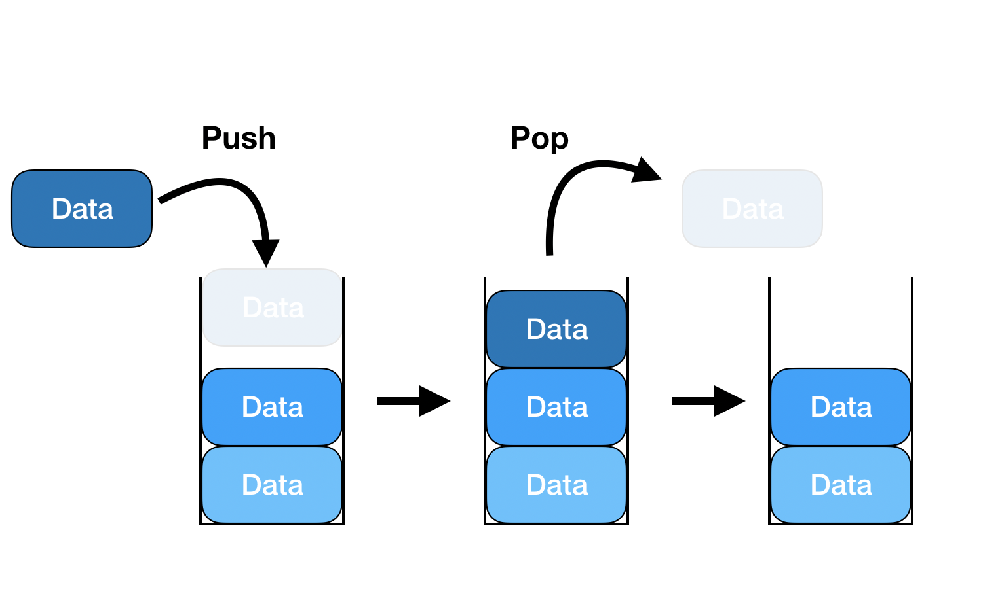

# 핵심 아이디어
### ✅ 올바른 접근: 스택(그리디) 사용


1. 왼쪽부터 숫자를 하나씩 확인하면서
2. 스택에 쌓은 숫자보다 큰 숫자가 오면 앞 숫자를 pop()
3. 이 과정을 k번 제거할 때까지 반복
4. 마지막에 k가 남아있다면 뒤에서 제거

# 내 풀이 / 내가 못푼 이유
```py
def solution(number, k):
    answer = ''
    # 맨 앞 자리부터 큰 수 고르기
    start = 0
    k = len(number) - k
    while(k != (0)):
        max = 0
        for i,num in enumerate(number):
            if ((int(num) > int(max)) and (((len(number) -1) - i) >= (k-1))):
                max = num
                max_index = i
        answer = answer + number[max_index]
        
        k = k - 1
        start = max_index + 1
        number = number[start:]
        
    return answer
```
- 매 번 for 문을 수행하니 시간 복잡도가 O(n^2)
- Stack을 이용하지 못함.(이용할 생각을 못함)

# GPT 풀이
```py
def solution(number, k):
    stack = []
    for num in number:
        # 스택에 값이 있고, k > 0이며, 현재 숫자가 스택 top보다 크면 pop
        while stack and k > 0 and stack[-1] < num:
            stack.pop()
            k -= 1
        stack.append(num)

    # 아직 제거 횟수가 남았다면 뒤에서 제거
    if k > 0:
        stack = stack[:-k]

    return ''.join(stack)
```
- 각 숫자는 최대 한 번 push, 한 번 pop → O(n)

- number 길이가 1,000,000이어도 충분히 통과<br>
=> 제약조건 잘 봐야하는 이유! (number는 2자리 이상, 1,000,000자리 이하인 숫자입니다.) -> 숫자가 크니 복잡도 줄여야해!

# 다른 사람의 풀이
1.
```py
def solution(number, k):
    st = []
    for i in range(len(number)):
        while st and k > 0 and st[-1] < number[i]:
            st.pop()
            k -= 1
        st.append(number[i])
    return ''.join(st[:len(st) - k])
```
