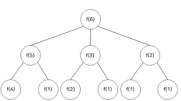

-> 문제를 풀기 전에 함수가 호출되는 과정을 그림으로 그려보면 이해하는데 도움이 된다. <br>
-> 동일하게 호출되는게 있으므로 다이나믹 프로그래밍!!!

### 점화식 표현

- ai = min(ai-1, ai/2, ai/3, ai/5) + 1 (이때 ai는 숫자 i일때 함수 호출 횟수)

```py
x = int(input())

d = [0] * 30001
W
for i in range(2, x+1):
    d[i] = d[i - 1] + 1

    if i % 2 == 0:
        d[i] = min(d[i], d[i // 2] + 1)
    
    if i % 3 == 0:
        d[i] = min(d[i], d[i // 3] + 1)
    if i % 5 == 0:
        d[i] = min(d[i], d[i // 5] + 1)
    
print(d[x])
```