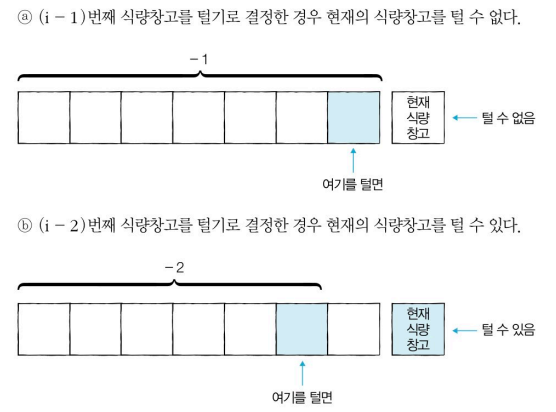

# 문제 해설
- 그림으로 도식화 하면 어렵지 않다!
- 점화식:
    - 왼쪽부터 차례대로 식량창고를 턴다고가정하면 어렵지 않다.
        1. 왼쪽부터 차례대로 식량창고를 털지 안 털지를 결정하는 경우
        2. 특정한 i번째 식량창고에 대해서 털지 안 털지의 여부 결정

    
    ⭐왼쪽부터 (i-3)번째 이하의 식량 창고에 대한 최적의 해에 대해서는 고려할 필요가 없다. -> d[i-2]는 d[i-1]과 d[i-2]을 구하는 과정에서 이미 계산됨.
    <br><br>
    ### 점화식: ai = max(ai-1, ai-2 + ki)

```py
# 정수 N을 입력받기
n = int(input())
# 모든 식량 정보 입력받기
array = list(map(int, input().split()))

# 앞서 계산된 결과를 저장하기 위한 DP 테이블 초기화
d = [0] * 100

# 다이나믹 프로그래밍 진행(보텀업)
# 계수 0부터 시작(인덱스)
d[0] = array[0]
d[1] = max(array[0], array[1])
for i in range(2, n):
    d[i] = max(d[i - 1], d[i - 2] + array[i])
    
# 계산된 결과 출력
print(d[n - 1])
```