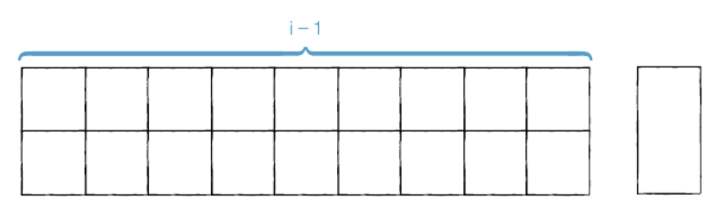
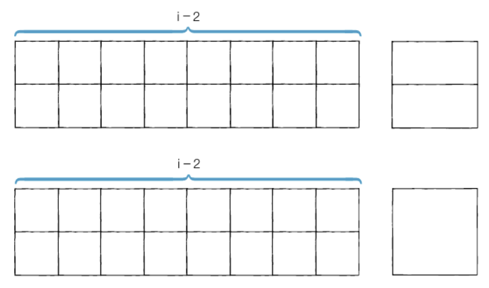

# 문제 해설
- 타일형 문제 유형.
- 왼쪽부터 차례대로 바닥을 덮개로 채운다고 생각하면 어렵지 않게 점화식을 채울 수 있다.
- 이 문제 역시 i번째 위치에 대한 최적의 해를 구할 때 왼쪽부터 (i-3)번째 이하의 위치에 대한 최적의 해에 대해서는 고려할 필요가 없다. 왜냐하면, 사용할 수 있는 덮개의 형태가 최대 2x2크기의 직사각형이기 때문이다.

1. 왼쪽부터 i-1까지 길이가 덮개로 이미 채워져 있으면 2x1의 덮개를 채우는 하나의 경우밖에 존재하지 않는다.



2. 왼쪽부터 i-2까지 길이가 덮개로 이미 채워져 있으면 1x2 덮개 2개를 넣는 경우, 혹은 2 x 2의 덮개 하나를 넣는 경우로 2가지 경우가 존재한다. 참고로 2x1 덮개 2개를 넣는 경우를 고려하지 않는 이유는 1에서 이미 해당 경우가 고려되었기 때문이다.



<br><br>

## 점화식: ai = ai-1 + ai-2 x 2

```py
n = int(input())

d = [0] * 1001

d[1] = 1
d[2] = 3
for i in range(3, n+1):
    d[i] = (d[i - 1] + 2 * d[i-2]) % 796796

print(d[n])
```
