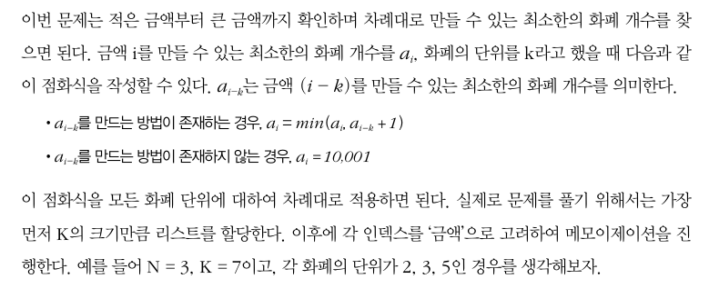
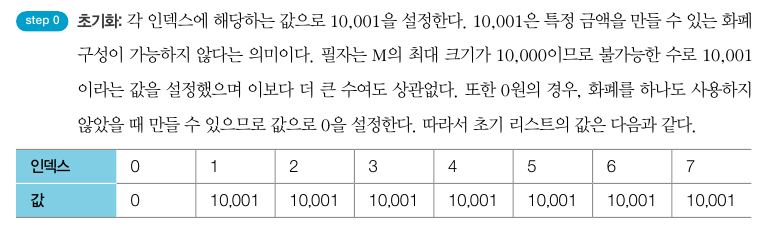
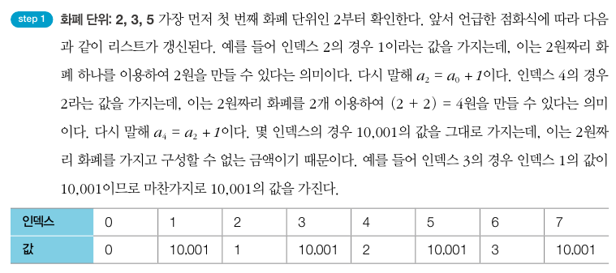
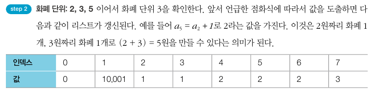
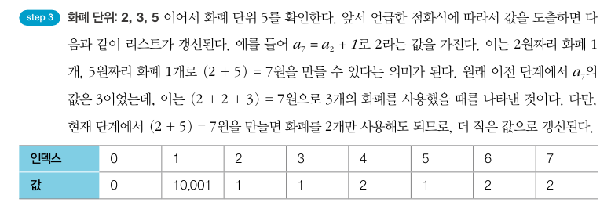

# 문제 해설
- 이 문제는 화폐 단위에서 큰 단위가 작은 단위의 배수가 아니라는 점이 다르다 -> 그리디로는 풀 수X 다이나믹 프로그래밍 이용!!
- 적은 금액부터 큰 금액까지 확인하며 차례대로 만들 수 있는 최소한의 화폐 개수 찾기!
    - 금액 i를 만들 수 있는 최소한의 화폐 개수를 ai, 화폐의 단위를 k.
    - ai-k는 금액 (i-k)를 만들 수 있는 최소한의 화폐 개수
        - ai-k를 만드는 방법이 존재하는 경우. ai = min(ai, ai-k + 1)
        - ai-k를 만드는 방법이 존재하지 않는 경우. ai = 10,001








```py
n, m =map(int, input().split())

array = []
for i in range(n):
    array.append(int(input()))

d = [10001] * (m+1)

d[0] = 0
for i in range(n):
    for j in range(array[i], m+1):
        if d[j - array[i]] != 10001:
            d[j] = min(d[j], d[j-array[i]] + 1)

if d[m] == 10001:
    print(-1)
else:
    print(d[m])
```